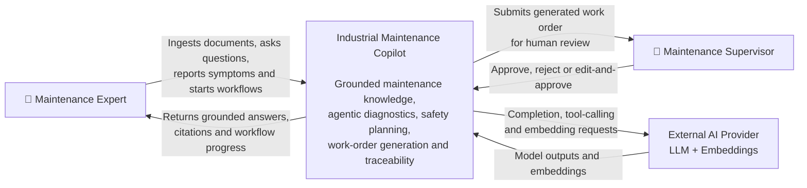
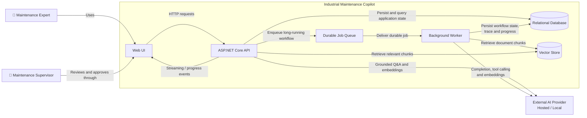
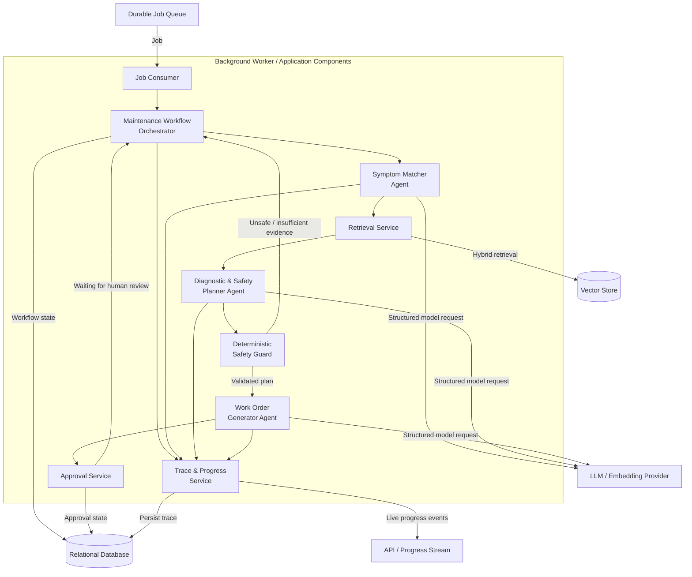
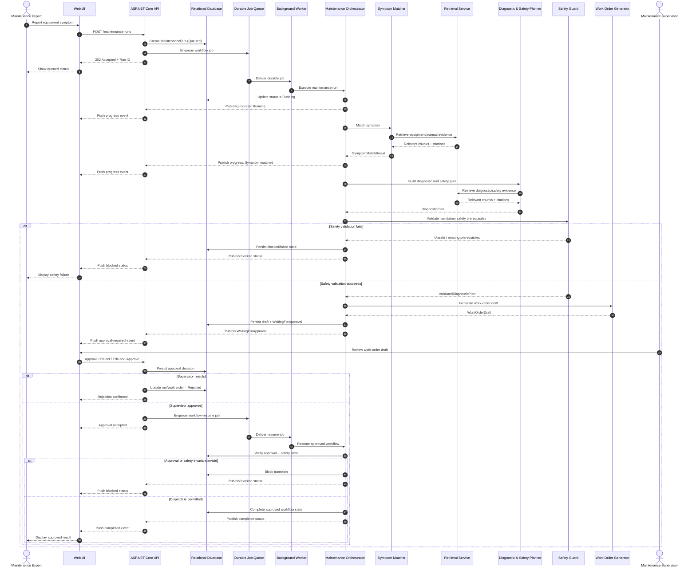
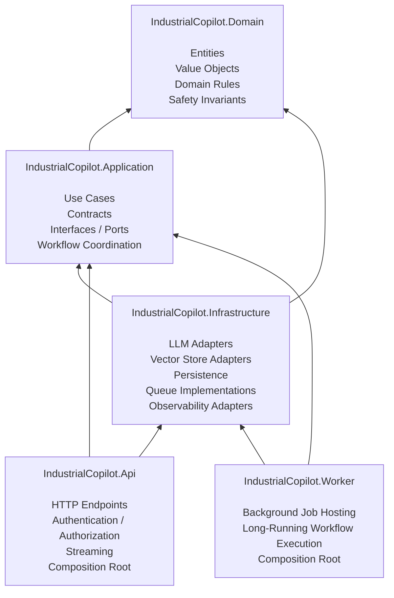

# Architecture

This document describes the architecture of the Industrial Maintenance Copilot using the C4 model and supporting architectural diagrams.

The diagrams are maintained as source in the repository so that architectural changes can be reviewed and versioned alongside the code.

---

## Current implemented runtime (Issues #21 / #23 / #25 / #27)

English/Arabic presentation uses standard API request localization and an explicit
Application narrative culture. Domain scope, safety policy, authorization and source
citations are culture-independent. The separately guarded demo executable replaces
only the LLM boundary and exercises the real API, PostgreSQL and Worker adapters.
See [ADR-007](adr/ADR-007-presentation-language-boundary.md) and the
[reproducible demo guide](DEMO-GUIDE.md). The orchestration pattern remains a
Sequential Pipeline with bounded tool loops and final-scope safety revalidation.

The executable system has three specialized agents, a sequential Application
orchestrator, OpenAI/Ollama adapters, and keyword/dense/hybrid retrieval using
PostgreSQL and pgvector. Operational PostgreSQL stores lifecycle, reviewed scope,
verifications, approval provenance, dispatch reservations and separate traces.

```mermaid
flowchart LR
    Client[Angular client — untrusted] -->|Authenticated REST / SSE| API[API trusted host]
    API -->|202 submission| Jobs[(PostgreSQL reasoning jobs)]
    Jobs -->|Lease and fenced replay| Reasoning[Reasoning Worker]
    Reasoning --> Orch[Application orchestrator]
    Jobs -->|Durable progress observer| API
    Orch --> Agents[Three specialized agents]
    Agents --> RAG[Scoped RAG / trusted retrieval]
    Orch --> Safety[Deterministic safety policy]
    Safety --> Proposal[Pending work order]
    Proposal --> Review[Human review]
    Review -->|Edits| Exact[Exact-content safety reassessment]
    Exact --> Approval[Atomic EditAndApprove]
    Review --> Approval
    Approval --> Verification[Authorized physical verification]
    Verification --> Reservation[Durable dispatch reservation]
    Reservation --> External[Independent dispatch inbox / adapter]
    Worker[Reconciliation Worker] -->|Bounded durable discovery| Reservation
    Worker -->|Same-key reconciliation| External
```



The durable `/api/jobs` path persists a Queued run and job before returning 202.
A separate hosted service claims bounded PostgreSQL leases and invokes the same
orchestrator. Progress is durable and GET SSE observes it without owning execution.
After a crash, a new attempt replays before atomic review publication; publication
already committed is recognized without generating a second order. No lease is
held during human approval. See [ADR-008](adr/ADR-008-durable-async-reasoning-jobs.md).
The original `/api/runs` and `/api/runs/stream` remain request-owned compatibility
paths used by the unchanged Angular diagnosis page. The durable API has a separate
deterministic smoke harness; this slice does not add a new UI job dashboard.

The client has lazy routes, typed API adapters, Reactive Forms and local signals.
REST DTOs follow camelCase HTTP contracts; bounded fetch-based SSE explicitly
normalizes PascalCase envelopes/numeric progress. It never replays the start POST.
Credentials and observed records stay in memory. Dashboard is session activity
because the API has no global list endpoint. Approval/verification appear only
after host responses. Any scope edit invalidates the preview; requirements are
echoed for comparison and reassessed by the host. Dispatch refresh is GET-only;
Uncertain remains distinct from success/failure. See [frontend setup](FRONTEND-SETUP.md)
and the [design system](../design-system/industrial-maintenance-copilot/MASTER.md).

Four trusted capabilities exist: manual evidence retrieval and equipment context
(read-only), deterministic safety validation, and externally side-effecting
approved dispatch. No reasoning-agent role receives dispatch authority. HTTP
identity comes from configured host authentication, never an actorId in a body.
Approval, physical verification and dispatch have independent equipment-scoped
permissions. Edited scope is reassessed by IExecutableSafetyPolicy; submitted
requirements are comparison-only. Pending/Uncertain dispatch freezes persist until
confirmed acceptance or definitive nonacceptance. Tracing is observational, not
a source of business authority.

Actual Application ports include ILlmProvider (also embeddings), IRetrievalService,
IDocumentProcessor, IKnowledgeIndex, IWorkflowStore, IWorkOrderApprovalService,
ISafetyPolicy, IExecutableSafetyPolicy, IActionAuthorization, IDispatchAttemptStore,
IExternalDispatch, IReconciliationDiscovery and IRunTraceStore. See
[ADR-006](adr/ADR-006-api-streaming-reconciliation.md) and
[host setup/demo](HOST-SETUP.md) for implemented endpoints, configuration and limits.

# C4 target architecture — design reference

The following original diagrams describe the broader target, not a deployment
inventory. Queue-based reasoning, generic job resumption and illustrative
repository/queue/embedding port names below remain planning concepts; the current
runtime and actual port names above take precedence. ADRs retain their original
issue scope, with later decisions linked explicitly.

## Level 1 — System Context

The Industrial Maintenance Copilot supports industrial maintenance experts by providing grounded access to equipment documentation and by orchestrating a safety-aware maintenance workflow from a reported symptom to a supervisor-reviewed work order.

### People

**Maintenance Expert**

Uses the system to:

- Ingest and search maintenance documentation.
- Ask grounded questions with citations.
- Report equipment symptoms.
- Start maintenance workflows.
- Inspect workflow progress and results.

**Supervisor**

Acts as the human approval authority for consequential maintenance actions.

The supervisor can review, edit, approve, or reject a generated work order before dispatch.

### External Systems

**LLM / Embedding Provider**

Provides model capabilities required for language generation, structured agent outputs, and document embeddings.

The system accesses AI providers through application abstractions so that hosted and local implementations can be selected through configuration.

### System Context Diagram



### System Boundary

The Industrial Maintenance Copilot is treated as a single software system at this level.

Internal implementation details such as the API, background worker, relational database, vector store, queue, and orchestration components are intentionally omitted from the System Context diagram and are described in the Level 2 Container diagram.
---

## Level 2 — Container Diagram

The Industrial Maintenance Copilot is divided into independently responsible runtime applications and data stores.

The architecture separates synchronous HTTP interactions from long-running agentic workflows. Maintenance workflow requests are persisted and queued before being processed by a background worker, allowing the API to return immediately while work continues asynchronously.

### Containers

**Web UI**

Provides the user-facing interface for document ingestion, grounded Q&A, workflow execution, live progress, approval actions, and run trace inspection.

Communicates with the API over HTTP and receives live progress and streaming events.

**ASP.NET Core API**

Provides the documented HTTP API and acts as the primary entry point to the system.

Responsibilities include:

- Authentication and authorization.
- Request validation.
- Document ingestion requests.
- Grounded Q&A requests.
- Starting and cancelling maintenance workflows.
- Supervisor approval actions.
- Run and trace queries.
- Streaming responses and progress events.

Long-running maintenance workflows are not executed inside the HTTP request lifecycle. The API persists the run, submits work to the job queue, and returns an accepted response.

**Background Worker**

Consumes durable jobs from the queue and executes long-running application workflows.

Responsibilities include:

- Executing the maintenance orchestrator.
- Invoking specialised agents through application abstractions.
- Persisting workflow state and progress.
- Respecting cancellation requests.
- Supporting retry and recovery behavior.
- Pausing workflows at the human approval gate.

The Worker is hosted separately from the API so background workloads do not consume or depend on HTTP request lifetimes.

**Job Queue**

Provides durable asynchronous communication between the API and Background Worker.

It enables long-running jobs to be processed outside the HTTP request lifecycle and supports the T7 requirements for restart survival, cancellation, resumability, and idempotent processing.

**Relational Database**

Stores durable structured application state, including:

- Users and roles.
- Document metadata and ingestion status.
- Maintenance runs.
- Workflow state.
- Work orders.
- Approval records.
- Job state and idempotency information.
- Audit and trace metadata.
- Token and cost accounting.
- Persistent session history.

**Vector Store**

Stores document chunk embeddings and retrieval metadata required for semantic retrieval.

Chunk records remain traceable to their source document, section, page, revision, and other metadata required for verifiable citations.

**External AI Provider**

Provides hosted or local capabilities for:

- Language-model completion.
- Streaming generation.
- Tool calling.
- Embeddings.

The Application layer accesses these capabilities through provider abstractions. Concrete provider implementations are adapters selected through configuration and may participate in a documented fallback chain.

### Container Diagram



### Synchronous and Asynchronous Paths

The system intentionally supports two execution paths.

**Synchronous / streaming path**

Used for interactions such as grounded question answering where work can be performed within a bounded request or streaming connection:

```text
User → UI → API → Retrieval → LLM → Grounded Answer + Citations
```

**Asynchronous workflow path**

Used for long-running maintenance workflows:

```text
User
  → UI
  → API
  → Persist Run
  → Durable Job Queue
  → 202 Accepted

Durable Job Queue
  → Background Worker
  → Orchestrator
  → Specialised Agents
  → Human Approval Gate
  → Final Workflow State
```

This separation prevents long-running agent execution from being tied to an HTTP request and provides the architectural foundation for the T7 Async Long-Running Jobs requirements.

### Container Boundaries

Business rules and use cases are not owned by the API or Worker containers.

Both are composition and hosting boundaries around the Application and Domain layers defined in ADR-001.

External technology-specific implementations remain in Infrastructure and are accessed through application abstractions.
---

## Level 3 — Component Diagram

This level focuses on the application components involved in executing the Industrial Maintenance workflow.

The workflow uses an orchestrator with three specialised agents. Agents communicate through typed contracts rather than unrestricted free-form text, and safety-critical transitions are validated by deterministic application and domain rules.

### Core Components

**Maintenance Workflow Orchestrator**

Coordinates the multi-step maintenance workflow.

Responsibilities include:

- Managing workflow state and transitions.
- Invoking specialised agents in the required order.
- Enforcing maximum iteration limits.
- Applying per-step timeouts.
- Coordinating retries with backoff.
- Responding to cancellation requests.
- Publishing progress events.
- Persisting trace information.
- Pausing execution at the human approval gate.
- Gracefully degrading when an agentic workflow cannot continue safely.

**Symptom Matcher Agent**

Interprets the reported symptom and identifies relevant equipment and maintenance evidence.

Its output is a typed symptom-matching result containing evidence references rather than unrestricted text intended directly for another agent.

**Diagnostic & Safety Planner Agent**

Uses retrieved maintenance evidence to produce a structured diagnostic plan containing:

- Diagnostic steps.
- Required safety prerequisites.
- Supporting citations.
- Evidence references.

The planner does not have authority to dispatch work or bypass deterministic safety validation.

**Work Order Generator Agent**

Transforms a validated diagnostic plan into a structured draft work order.

It can generate a draft but cannot approve or dispatch the work order.

**Retrieval Service**

Provides grounded evidence from the ingested maintenance corpus.

It retrieves chunks together with traceable metadata such as document, section, page, equipment, and manual revision.

The retrieval component is responsible for returning evidence to agents and other application use cases but does not allow retrieved document text to become system instructions.

**Safety Guard**

Applies deterministic safety rules independently of LLM output.

It prevents safety-critical workflow transitions when mandatory safety prerequisites are missing or unsatisfied.

Safety enforcement is therefore a software invariant rather than a prompt instruction.

**Approval Service**

Manages the human approval gate.

A generated work order enters a pending approval state and cannot be dispatched until an authorised supervisor performs one of the supported review actions:

- Approve.
- Reject.
- Edit and approve.

Approval decisions are persisted and audited.

**Trace and Progress Service**

Records inspectable workflow execution information and publishes progress events.

Trace data includes the run identifier, executed component or agent, evidence used, tool activity, workflow status, and model usage information required for observability and cost accounting.

### Component Diagram



### Agent Contracts

Agent-to-agent communication uses typed application contracts.

Conceptually, the workflow passes structured results similar to:

```text
SymptomMatchResult
    ├── Equipment reference
    ├── Applicable manual revision
    ├── Matched symptoms
    ├── Evidence references
    └── Confidence / evidence status

            ↓

DiagnosticPlan
    ├── Diagnostic steps
    ├── Safety prerequisites
    ├── Evidence references
    └── Citations

            ↓

ValidatedDiagnosticPlan
    ├── Diagnostic steps
    ├── Verified safety prerequisites
    └── Citations

            ↓

WorkOrderDraft
    ├── Equipment reference
    ├── Proposed actions
    ├── Safety prerequisites
    └── Citations
```

Concrete schemas will be defined in application contracts and validated before outputs are accepted by downstream workflow components.

### Safety Boundary

LLM output is treated as untrusted input.

A model may propose diagnostic actions and safety prerequisites, but it cannot authorise a safety-critical state transition.

Conceptually:

```text
LLM-generated plan
        ↓
Structured schema validation
        ↓
Evidence validation
        ↓
Deterministic Safety Guard
        ↓
Domain / application invariants
        ↓
Eligible for Work Order Draft
        ↓
Supervisor Approval
        ↓
Eligible for Dispatch
```

Missing mandatory safety prerequisites, insufficient evidence, invalid structured output, or rejected supervisor approval prevent the workflow from reaching dispatch.

### Agent Tool Boundaries

Each specialised agent receives only the tools required for its role.

The Symptom Matcher is limited to symptom and retrieval-related capabilities.

The Diagnostic & Safety Planner can retrieve evidence and construct diagnostic and safety plans but cannot approve or dispatch work.

The Work Order Generator can construct a draft work order but cannot approve or dispatch it.

Side-effecting or consequential actions are kept outside unrestricted agent control and require the human approval gate where applicable.

### Component Ownership

These components represent Application and Domain responsibilities.

Concrete SDK integrations for LLM providers, vector stores, queues, databases, and observability systems remain Infrastructure adapters in accordance with ADR-001.
---

## Maintenance Workflow Sequence

The following sequence describes the primary asynchronous Industrial Maintenance workflow from symptom submission through agent execution, deterministic safety validation, human approval, and completion.



### Immediate Submission Response

Starting a maintenance workflow does not wait for agent execution to complete.

The API:

1. Validates the request.
2. Creates a durable maintenance run.
3. Enqueues the workflow job.
4. Returns `202 Accepted` with the run identifier.

The background Worker performs the long-running execution independently from the originating HTTP request.

### Progress Streaming

Workflow progress is published as state transitions occur.

Examples include:

```text
Queued
Running
MatchingSymptom
PlanningDiagnostics
ValidatingSafety
GeneratingWorkOrder
WaitingForApproval
Approved
Rejected
Blocked
Cancelled
Failed
Completed
```

The client receives progress through the system's real-time communication mechanism without polling for every state transition.

The concrete SSE or WebSocket implementation is an infrastructure/API decision and does not change the application workflow contract.

### Human Approval and Resume

Human approval is modeled as a durable workflow state rather than as a blocking in-memory operation.

When a work-order draft requires supervisor review, the workflow persists its state and ends the current execution.

A later approval action causes the workflow to resume through a new durable job.

This design allows approval to occur minutes or hours after the original workflow execution without requiring a Worker process or HTTP request to remain active.

### Cancellation

Cancellation is represented as durable workflow intent.

The API records a cancellation request for the run. The Worker and Orchestrator check cancellation at safe execution boundaries and stop further processing when cancellation is observed.

Cancellation does not rely solely on terminating an HTTP connection.

### Safety Before Consequential Transition

Supervisor approval alone is not sufficient to bypass safety rules.

Before a consequential workflow transition is allowed, the application verifies both:

```text
Supervisor approval is valid
AND
Mandatory safety prerequisites are satisfied
```

If either condition is false, the transition is blocked.
---

## Layer Dependency Diagram

The solution follows Clean Architecture and enforces inward-facing source-code dependencies.

The Domain and Application layers remain independent from concrete infrastructure technologies such as LLM SDKs, vector-store SDKs, databases, queues, and web frameworks.



### Dependency Rules

The following source-code dependencies are permitted:

```text
Application      → Domain

Infrastructure   → Application
Infrastructure   → Domain

API              → Application
API              → Infrastructure

Worker           → Application
Worker           → Infrastructure
```

The following dependencies are prohibited:

```text
Domain       -X-> Application
Domain       -X-> Infrastructure
Domain       -X-> API
Domain       -X-> Worker

Application  -X-> Infrastructure
Application  -X-> API
Application  -X-> Worker
```

### Dependency Inversion

Application use cases depend on abstractions rather than concrete external technologies.

For example:

```text
Application
    └── ILlmProvider
    └── IEmbeddingProvider
    └── IKnowledgeRetriever
    └── IJobQueue
    └── IWorkOrderRepository

Infrastructure
    └── HostedLlmProvider : ILlmProvider
    └── LocalLlmProvider : ILlmProvider
    └── VectorKnowledgeRetriever : IKnowledgeRetriever
    └── DurableJobQueue : IJobQueue
    └── WorkOrderRepository : IWorkOrderRepository
```

Infrastructure implementations therefore depend on contracts owned by the Application layer rather than forcing Application code to depend on infrastructure SDKs.

### Enforcement

Layer boundaries are enforced through project references and dependency injection.

The current intended project-reference structure is:

```text
IndustrialCopilot.Domain
    → no project dependencies

IndustrialCopilot.Application
    → IndustrialCopilot.Domain

IndustrialCopilot.Infrastructure
    → IndustrialCopilot.Application
    → IndustrialCopilot.Domain

IndustrialCopilot.Api
    → IndustrialCopilot.Application
    → IndustrialCopilot.Infrastructure

IndustrialCopilot.Worker
    → IndustrialCopilot.Application
    → IndustrialCopilot.Infrastructure
```

Additional architecture tests may be introduced to prevent accidental dependency violations as the implementation grows.
---

## Core Domain Model and Application Ports

The initial architecture identifies the core business concepts and external capability boundaries required by the Industrial Maintenance workflow.

These definitions establish architectural ownership and are intentionally implementation-independent. Concrete entity schemas, value objects, and persistence mappings will evolve during implementation.

### Core Domain Concepts

**Equipment**

Represents the industrial equipment being diagnosed or maintained.

It provides the business identity against which symptoms, manuals, diagnostic plans, and work orders are associated.

**Manual**

Represents maintenance or technical documentation associated with equipment.

A manual may have multiple revisions.

**ManualRevision**

Represents a specific revision of a maintenance manual.

The applicable revision must remain identifiable so diagnostic evidence and citations can be traced to the correct source version.

**MaintenanceRun**

Represents one execution of the industrial maintenance workflow.

It maintains durable workflow state across asynchronous execution, human approval, cancellation, failure, and resume operations.

Conceptual states include:

```text
Queued
Running
WaitingForApproval
Approved
Rejected
Blocked
Cancelled
Failed
Completed
```

**DiagnosticStep**

Represents a structured diagnostic action proposed as part of a maintenance plan.

Diagnostic steps remain associated with supporting evidence and citations.

**SafetyPrerequisite**

Represents a safety condition that must be satisfied before a safety-critical maintenance transition is permitted.

Mandatory safety prerequisites are enforced by deterministic business rules and cannot be bypassed by LLM output.

**WorkOrder**

Represents the maintenance work proposed as the result of the diagnostic workflow.

A work order is initially generated as a draft and cannot progress to a consequential dispatch state unless the required safety and approval invariants are satisfied.

Conceptual states include:

```text
Draft
PendingApproval
Approved
Rejected
Dispatched
```

**ApprovalRequest**

Represents the human review required before a consequential work-order action.

It records the supervisor decision and supports:

```text
Approve
Reject
EditAndApprove
```

Approval decisions must be durable and auditable.

### Key Domain Invariant

The architecture treats the following rule as a business invariant:

```text
Work Order Dispatch Allowed
        =
Valid Supervisor Approval
        AND
All Mandatory Safety Prerequisites Satisfied
```

Neither an LLM-generated recommendation nor supervisor approval alone can bypass this rule.

### Application Ports

The Application layer owns abstractions for capabilities implemented by external infrastructure.

Initial application ports include:

**ILlmProvider**

Provides model completion, structured generation, streaming, and tool-calling capabilities without exposing a concrete LLM SDK to the Application layer.

**IEmbeddingProvider**

Generates embeddings through a provider-independent application contract.

**IKnowledgeRetriever**

Retrieves grounded maintenance evidence and traceable citation metadata without exposing the concrete vector-store SDK.

**IJobQueue**

Submits durable asynchronous work without coupling application use cases to a specific queue technology.

**IMaintenanceRunRepository**

Loads and persists durable maintenance workflow state.

**IWorkOrderRepository**

Loads and persists work-order state.

**IProgressPublisher**

Publishes workflow progress through an application abstraction without coupling workflow logic to SSE, WebSocket, or another transport.

**ITraceRecorder**

Records inspectable execution information such as workflow steps, agent activity, evidence usage, and model usage.

### Ownership Rule

Interfaces representing capabilities required by application use cases are owned by the Application layer.

Concrete implementations belong to Infrastructure.

Conceptually:

```text
Application
    │
    ├── ILlmProvider
    ├── IEmbeddingProvider
    ├── IKnowledgeRetriever
    ├── IJobQueue
    ├── IMaintenanceRunRepository
    ├── IWorkOrderRepository
    ├── IProgressPublisher
    └── ITraceRecorder
            ▲
            │ implements
            │
Infrastructure
    ├── Hosted / Local LLM adapters
    ├── Embedding adapters
    ├── Vector retrieval adapter
    ├── Durable queue adapter
    ├── Database repositories
    ├── Progress transport adapter
    └── Observability adapter
```

The exact technologies and concrete implementations are selected independently from the core Application and Domain layers.

### FR-1 staged ingestion (Issue #29)

Application composes Extract -> Clean -> Chunk -> Embed -> Index. Infrastructure implements strict UTF-8 and selectable-text PDF extraction, conservative cleaning and shared deterministic windows. Typed source metadata is additive; citations retain exact revision/page or text-line provenance. Knowledge migration 002 stores metadata and independent ingestion attempts. Completion commits atomically with replacement; ended processing sessions read as Interrupted. This operator workflow does not reuse ReasoningJob or grant safety authority. See [ADR-009](adr/ADR-009-staged-ingestion-and-attempt-reporting.md) and [corpus setup](CORPUS-INGESTION.md).

## Product RAG surface

Application `AskService` consumes the existing retrieval/provider ports. Request-owned SSE forwards generated answer deltas; API abort cancels retrieval/provider work. This is separate from Worker-owned T7 reasoning and its persisted observation stream. `IConversationStore` has an operations PostgreSQL adapter and migration006 with owner predicates, ordered/paginated turns, single-active-turn arbitration and fenced terminal finalization. Restart interruption becomes Failed after a90-second deadline, without replay.

The authenticated ingestion route calls the existing staged FR-1 pipeline and atomic knowledge index. Catalog associations are equipment-scoped; they do not grant executable safety policy. Angular Ask/Ingest pages and role-aware controls preserve the approval, verification and dispatch server boundaries. See [ADR-012](adr/ADR-012-request-owned-ask-and-conversations.md) for limits, evidence gate, history/data handling and cancellation semantics.

## Bounded resilience and usage accounting

The Sequential Pipeline now supports bounded transient read-only retries and explicitly advisory
grounded RAG degradation, plus persisted owner-scoped usage with unknown-aware optional pricing.
See [configuration, query semantics and proof](RESILIENCE-AND-USAGE.md). Human approval and verified safety
remain mandatory before dispatch; a degraded answer is never work-order authority.

## Evaluator packaging

The repository-owned Compose deployment packages the existing hosts behind a
production Angular/Nginx server and private PostgreSQL/pgvector. One-shot setup,
migrations and canonical ingestion gate startup. Random persisted demo credentials
and verified internal TLS preserve API authorization/transport boundaries; only
the loopback web port is published. The container/Development-only Demo entry point
reuses existing services, while independent production API/Worker image targets
retain normal configuration requirements. See [deployment](DEPLOYMENT.md) and
[ADR-014](adr/ADR-014-compose-evaluator-packaging.md). Durability is safe replay,
not resumption inside an interrupted model request.
